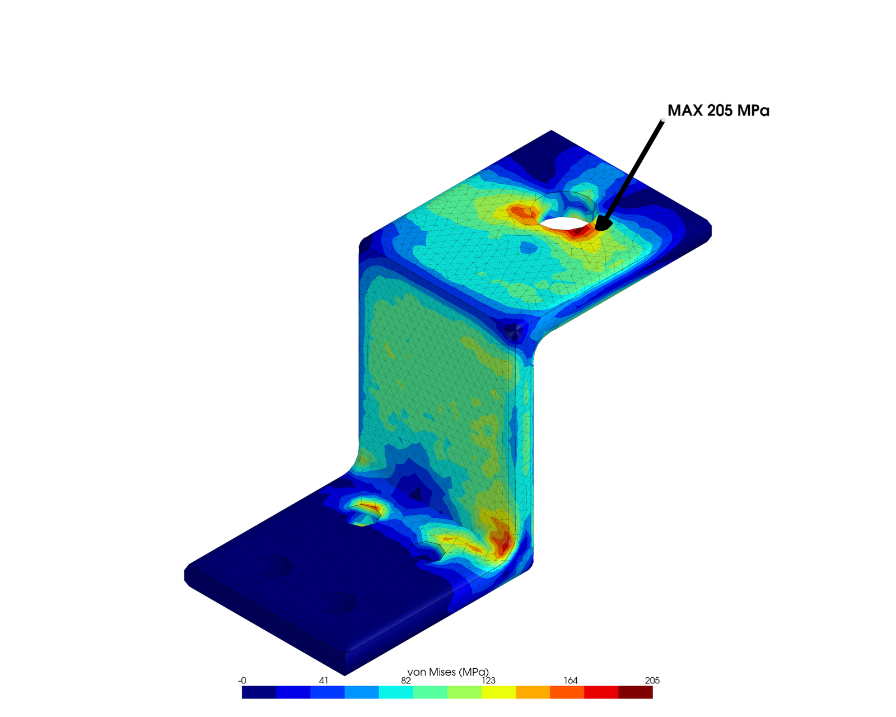
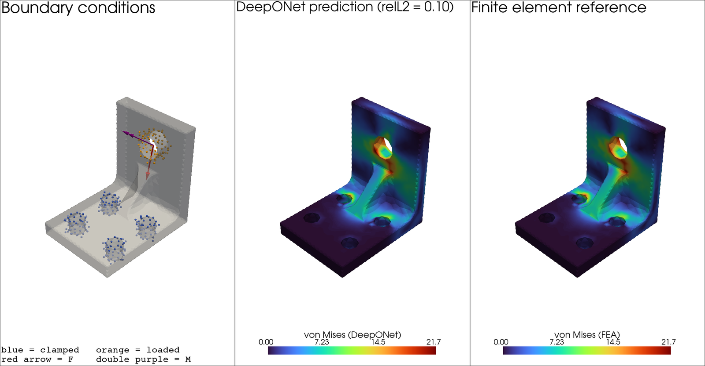
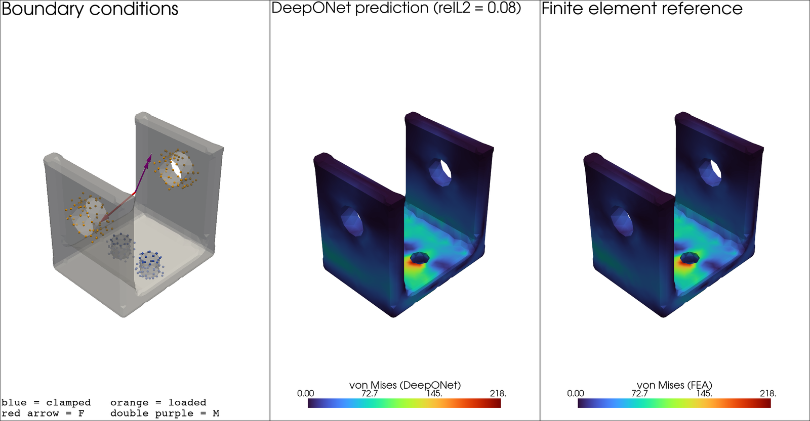
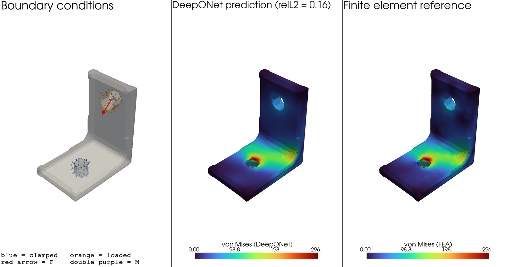
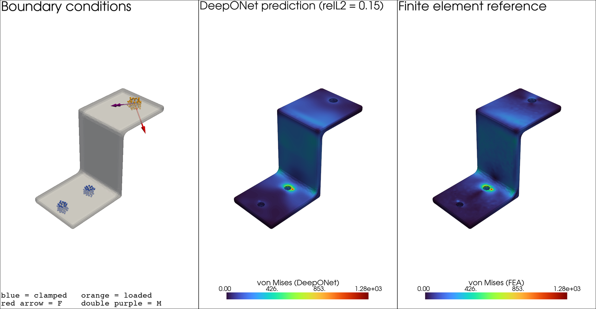
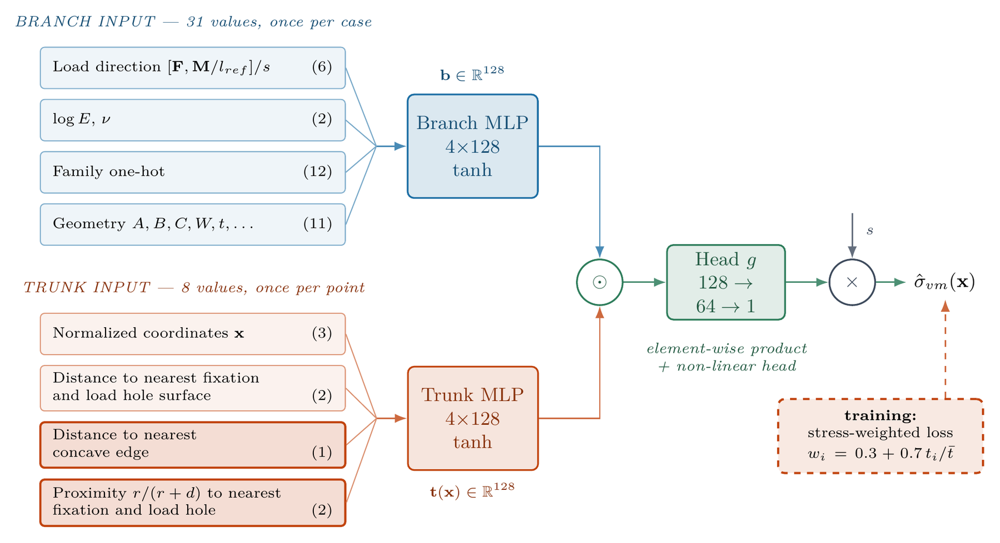
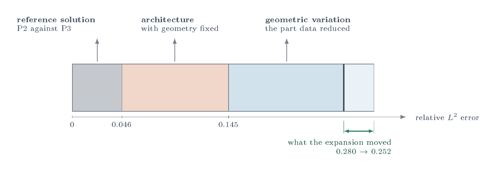
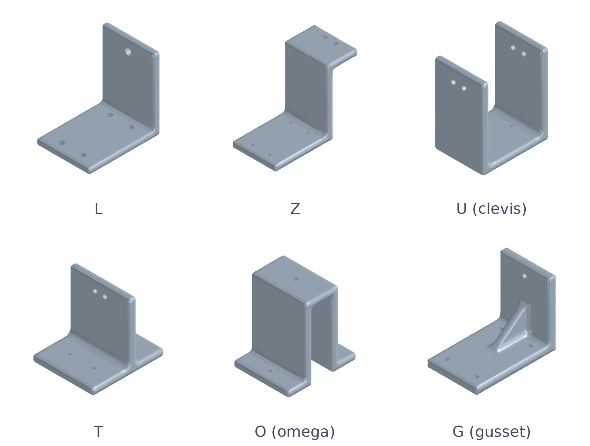

# A DeepONet Surrogate Model for Stress Fields in Parametric Bracket Families: The Cost of Geometric Generalization

<p align="center">
  
  <br><em>Finite element von Mises field of one of the 55,803 cases.</em>
</p>

A neural operator that predicts the **full von Mises stress field** of a
mechanical bracket from its geometry, load and material in **~50 ms**,
against ~23 s for the finite element solution it was trained on. One model
covers a catalogue of six structurally distinct parametric families.

Code of the MBA monograph of the same title, MBA in Artificial Intelligence
and Big Data, Institute of Mathematical and Computer Sciences (ICMC),
University of São Paulo, 2026.

- **Author:** Danilo Rizzo de Oliveira
- **Advisor:** Prof. Dr. João Luís Garcia Rosa
- **Co-advisor:** Prof. Dr. Alberto Costa Nogueira Junior
- **Dataset:** https://doi.org/10.5281/zenodo.22981969
- **Final trained model:** https://doi.org/10.5281/zenodo.23287064

## Results

| Final model | Relative L² field error |
|---|---|
| **Geometry varying**: six families, 8,370 validation cases | **0.193** |
| **Geometry fixed**: one part per family, only load and material vary | **0.102** |

Per family:

| Family | L | Z | U | T | O | G |
|---|---|---|---|---|---|---|
| Geometry varying | 0.168 | 0.164 | 0.182 | 0.201 | 0.249 | 0.207 |
| Geometry fixed | 0.094 | 0.097 | 0.091 | 0.107 | 0.122 | 0.100 |
| Median peak error, geometry varying | −5.6% | −5.6% | −4.3% | −8.7% | −13.1% | −10.6% |

- **The cost of geometric generalization, measured directly.** Holding the
  geometry fixed while load and material vary isolates what geometric
  variation adds: 0.091 of the 0.193, about half of the error. In a paired
  experiment, the model converges with the geometry fixed and begins to
  overfit with it varying.
- **One model for the whole catalogue.** A single model over six families is
  16% more accurate on the U family than a specialist trained on that family
  alone.
- **Peaks.** With the geometry varying, the median signed peak error is
  −7.5%; in the median fixed-geometry case of each family, the peak is
  within 6.8% on average.
  The peak is still underestimated, so the model is for design
  **screening**, not for verification.
- **Speed.** 51.8 ms per full field on a CPU against 22.7 s for the finite
  element pipeline: 438 times faster.

## Predictions

Validation cases of median error in their family: boundary conditions,
DeepONet prediction and finite element reference, on a shared colour scale.

**Geometry fixed** (one part per family; only load and material vary):

<p align="center">
  
  <br><em>Ribbed family (G), relative L² error 0.10.</em>
</p>

<p align="center">
  
  <br><em>Clevis family (U), relative L² error 0.08.</em>
</p>

**Geometry varying** (parts the model has never seen):

<p align="center">
  
  <br><em>L family, relative L² error 0.16.</em>
</p>

<p align="center">
  
  <br><em>Z family, relative L² error 0.15.</em>
</p>

## The model

<p align="center">
  
  <br><em>Geometry enters the branch as eleven explicit parameters; the trunk receives the coordinates and five geometric features (distances to the holes and to the concave edge, and proximity to the holes); the two meet in an element-wise fusion and a non-linear head; the load magnitude is restored analytically. The loss weights each point by its stress, so that the peaks count as they do in the error.</em>
</p>

No signed distance field and no learned shape encoder: the cheapest
geometric representation the literature allows, 145,666 parameters, trained
on a workstation and a rented T4.

## Where the error lies

<p align="center">
  
  <br><em>The error of the final model split into what the reference solution itself resolves (P2 against P3), what the architecture misses even with the geometry fixed, and what geometric variation adds.</em>
</p>

## Data

**55,803** finite element cases (FEniCSx, quadratic tetrahedra verified
against cubic ones), archived at the dataset DOI above in two forms: the complete
set, and a set without the mesh connectivity, five times smaller and enough
for training.

| Family | L | Z | U | T | O | G | Total |
|---|---|---|---|---|---|---|---|
| Cases | 9,999 | 10,000 | 9,999 | 8,751 | 8,486 | 8,568 | **55,803** |

<p align="center">
  
  <br><em>The six parametric families: L, Z, U, T, O and G.</em>
</p>

Each `sample_NNNNNN.npz` holds the mesh (`nodes`, `cells`), the fields at
the vertices (`u`, `stress`, `von_mises`), the material (`E`, `nu`), the
load (`loads`, `moments`, `l_ref`), the family index (`familia`: 0=L, 1=Z,
2=U, 3=T, 4=O, 5=G), the eleven geometric parameters (`geo_params`:
`A, B, C, W, T, RF, RB, DF, DL, NF, NL`) and the holes (`furos_fix`,
`furos_carga`: one row `[cx, cy, cz, ax, ay, az, r, half]` per fixation or
load hole). Those field names are Portuguese because they are written in the
archived files.

## Reproducing

Requirements: FEniCSx (dolfinx), gmsh and mpi4py for the generator; PyTorch
and NumPy for everything else; PyVista for the figures; SciPy for the
paired tests. Several scripts default to the author's project folder
(`PROJECT_DIR = ~/projetos/tcc_brackets`); adjust it if yours differs.

**1. Generate** (one run per family, quadratic elements; the sampling is
deterministic by seed and case index):

```bash
python generate_dataset.py --out-dir exp_L --family L --seed 0 --i0 0 --n 2000 --degree 2
python compact_dataset.py --src exp_L --dst exp_L_train     # training copy without connectivity
python concave_edges.py --dataset exp_L_train               # edges for --edge-distance
```

`--fixed-geometry <seed>` freezes the part and varies only load and
material; `--check-degree 3` re-solves each case with cubic elements on the
same mesh (the verification). The mesh itself is not bit-reproducible
(gmsh threads, fillet fallbacks), so regenerating gives a statistically
equivalent dataset; exact figures need the archived files.

**2. Train** the final model (as on Colab, `train_colab.ipynb`):

```bash
python train_deeponet.py --dataset dataset_v4_treino --device cuda \
  --batch 32 --n-query 1024 --repeats 1 --decoder prod \
  --hole-distances --edge-distance --hole-proximity \
  --stress-weight 1 --weight-floor 0.3 \
  --epochs 4000 --lr 3e-4 --eval-every 10 --save-every 10 \
  --final-eval 400 --resume --out final.pt
```

The model of the submitted version (tag `tcc-2026`, relative L² 0.252) used
the plain MSE and only the two hole distances: drop `--edge-distance`,
`--hole-proximity` and the two weighting options. It ran 3,187 epochs, at
10⁻³ until epoch 989 and then resumed once with `--lr 3e-4`, which restarts
the rate and the scheduler. Training writes `<out>_val_errors.csv`, the
per-case validation error.

**3. Evaluate:**

```bash
python inspect_cases.py --ckpt final.pt --dataset dataset_v4_treino --listing > listing.txt
python summarize_listing.py listing.txt          # per-family table
python compare_models.py a_val_errors.csv b_val_errors.csv   # paired test of two models
python diagnose_error.py --ckpt final.pt --dataset dataset_v4_treino   # error by region
```

## Scripts

| Script | Role |
|---|---|
| `generate_dataset.py` | Parametric geometry, meshing (gmsh) and finite element solution (FEniCSx); one `.npz` per case. |
| `compact_dataset.py` | Training copy of a dataset: no connectivity, float32. |
| `concave_edges.py` | Recovers the concave edges of every case from the generator's seed, verified against the stored parameters. |
| `bracket_dataset.py` | Branch and trunk encodings, distance features, normalization, PyTorch dataset. |
| `train_deeponet.py` | The DeepONet, the stress-weighted loss, the training loop with resume, and the checkpoint loader. |
| `train_colab.ipynb` | Training on a Colab GPU, resilient to session drops (final model, or that of the submitted version). |
| `inspect_cases.py` | Per-case figures, or a listing of every case with its error. |
| `summarize_listing.py` | Per-family table from a listing. |
| `evaluate_checkpoint.py` | Per-case validation error of a checkpoint, as CSV. |
| `compare_models.py` | Paired comparison of two models (Wilcoxon), by family. |
| `diagnose_error.py` | Error by region, by stress level and against each geometric parameter. |
| `median_case_images.py` | Figures of the typical (median-error) case of each family. |
| `verification_report.py` | Audit of a dataset: P2 against P3 table, generation time, parallel processes. |
| `ablation_p2.py` | The exploratory single-variable architecture study. |
| `benchmark_inference.py` | Inference timing. |
| `figs_*.py`, `fig_hero.py`, `render_families.py` | The remaining figures of the monograph. |

## Versions and names

The tag **`tcc-2026`** is the code of the version submitted to the examining
committee, and **`tcc-2026-final`** that of the final version. In between, the stress-weighted loss and the edge and proximity
features were added, and the code was translated: script names, option
names (`--dist-furos` → `--hole-distances`, `--caso` → `--case`, `--lista` →
`--listing`, `--grau` → `--degree`, ...), log lines and output files. The old
option names are still accepted, and checkpoints, logs and CSVs written
before the translation load unchanged.

## Citation

```bibtex
@misc{oliveira2026deeponet,
  author = {Oliveira, Danilo Rizzo de},
  title  = {A DeepONet Surrogate Model for Stress Fields in Parametric
            Bracket Families: The Cost of Geometric Generalization},
  year   = {2026},
  note   = {MBA monograph, Instituto de Ci{\^e}ncias Matem{\'a}ticas e de
            Computa{\c{c}}{\~a}o, Universidade de S{\~a}o Paulo}
}
```

## License

Code: MIT (see `LICENSE`). Data and models: CC BY 4.0, as stated on the Zenodo records.
